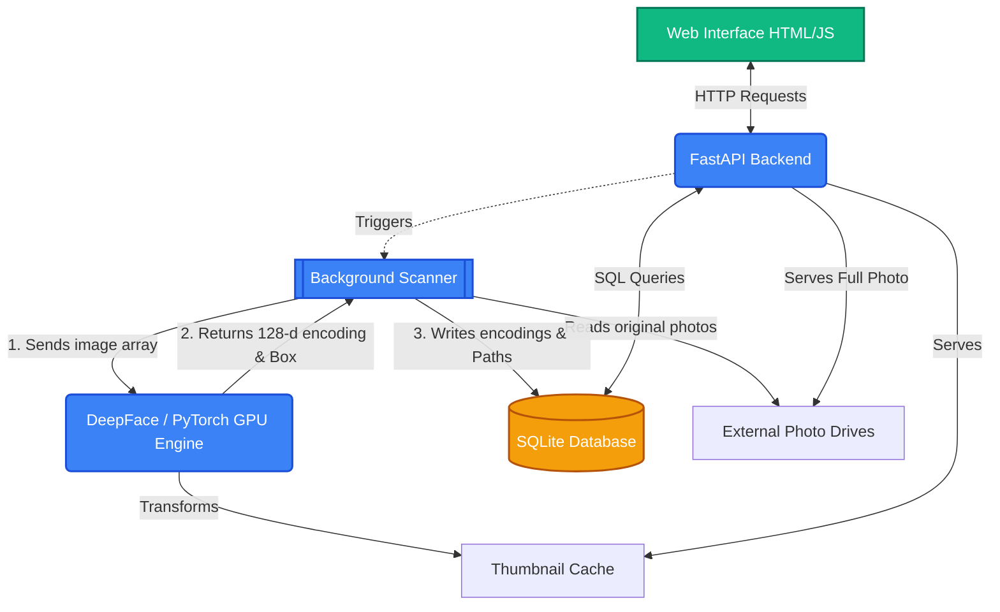

# Photo AI Manager

This is a totally local, private, AI-powered system designed to index large physical drives of photos, recognize faces, extract locations, and allow lightning-fast search.

---

## 🏗️ Architecture & Data Flow

Here is a high-level visual representation of how the components talk to one another:

---

## 📂 Script Breakdown

### 1. `main_backend.py` (The API Server)
This is the heart of the application. It runs the lightweight `FastAPI` server. 
* It serves the web UI styling and HTML.
* It safely executes background tasks to prevent locking up the frontend.
* *Fix History:* Overcame a strict `BackgroundTasks` Pydantic routing bug that prevented JavaScript `FormData` from triggering.

### 2. `scanner.py` (The Heavy Lifter)
This script recursively runs through your entire hard drive folder by folder. 
* **Smart Hashing:** It actively checks if a file is already in the database to prevent duplicate work.
* **Live Updates:** Passes a mutating memory dictionary (`status_dict`) directly to FastAPI so the web frontend can see live scanning updates per photo instead of waiting for the folder to finish.
* It reads the EXIF metadata to figure out the **Date Taken** and **GPS Coordinates**.

### 3. `face_utils.py` (The AI Engine)
Re-engineered to use **PyTorch and DeepFace** for robust GPU acceleration.
* *Fix History:* We previously used `dlib`, but the lack of pre-compiled cuDNN on Windows caused absolute Python segmentation faults. DeepFace utilizes bundled CUDA dependencies to prevent this.
* **Detection:** Specifically uses `RetinaFace` via PyTorch to find human faces correctly.
* **Extraction:** Turns the face into a 128-dimensional array mathematically.
* **Cropping:** Drops a 150x150 pixel thumbnail into `data/thumbnails/`.

### 4. `database.py` (The Memory)
The interface for exactly how data is read to and from the `index.db` SQLite file. It handles three tables:
1. **Photos**: Stores original paths and EXIF locations.
2. **Faces**: Stores the 128-d math arrays, bounding box coords, and linking IDs.
3. **People**: Stores string names that you have assigned to faces.

### 5. `templates/index.html` & `static/`
The UI. Built entirely with raw Javascript and customized CSS to keep dependencies low. Uses polling `fetch()` loops to dynamically update.
* *Upcoming:* Will be entirely replaced by an experimental **V2 UI**, pulled directly from Google Stitch integration utilizing an AI Context Bridge.
