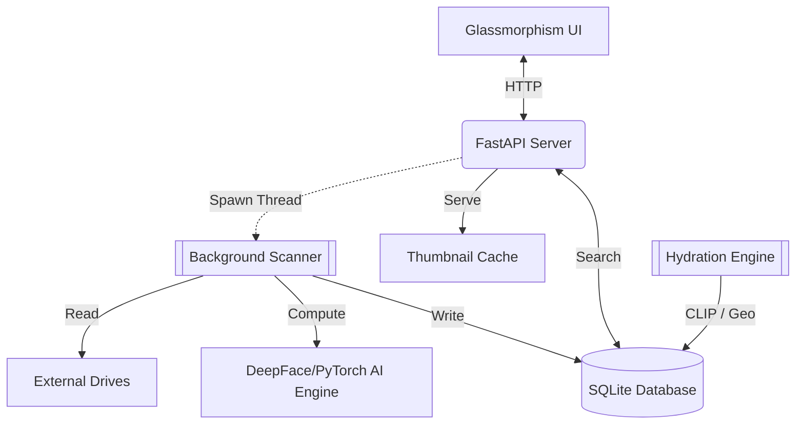
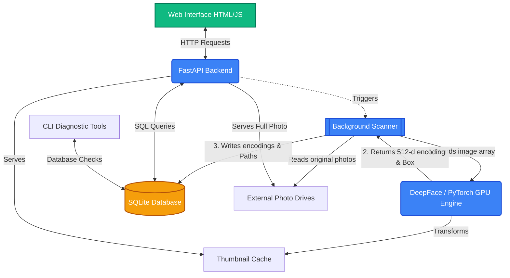

# Photo Manager V3: Intelligence Manifest
A high-performance, local-first AI photo management system with Deep Retrieval, Geocoded Atlas, and Precision Visual Anchoring.

## 🧬 Tactical V3.3 Stack
- **AI Core**: RetinaFace (Detection) + FaceNet512 (Recognition) + MobileNetV3 (Scene)
- **Visual Geocoder**: OpenAI CLIP (Precision Landmark Anchoring)
- **Intelligence Layer**: V3.3 ULTIMA Hydrator (Temporal GPS + Landmark Distillation)
- **Backend**: FastAPI (Python 3.11) + SQLite3 (WAL Mode)
- **Discovery UI**: Stealth Pro V3.3 (Leaflet Atlas + Infinite Scroll)

## ⚡ V3 Breakthrough Features
- **Visual Landmark Precision**: CLIP-based recognition identifies specific landmarks (e.g., Colosseum, Taj Mahal) to upgrade generic country GPS into high-precision map coordinates.
- **Geocoded Atlas**: Leaflet marker clustering handles large-scale libraries, shattering density bubbles into individual inspectable assets.
- **Temporal V3 Propagation**: Automatically propagates GPS data to non-GPS photos in the same session.
- **Path Rescue**: Brute-force indexing of folder names (e.g., "Turkey") even if images lack metadata.

## 🚀 Quick Start
1.  **Clone & Install**:
    ```bash
    pip install -r requirements.txt
    ```
2.  **Launch**:
    Run `run.bat` (Self-healing protocol clears port 8000 and restarts server).
3.  **Hydrate Precision**:
    Run `python tools/hydrate_metadata.py` to upgrade your library with visual landmarks.
4.  **UI**:
    Access the tactical dashboard at `http://localhost:8000`.

## 🛠️ Operational Support
All major V1-V2 bugs have been resolved. See [docs/bug_fixes.md](file:///c:/Raghava/Antigravity/photo_manager/docs/bug_fixes.md) for the full resolution log.

---

## 🏗️ Architecture & Decision Rationale

The Photo AI Manager is designed for **total privacy** and **high-performance local compute**. Every architectural choice prioritizes these two goals over cloud scalability.

### Architecture Overview
The system follows a **Monolithic API + Threaded Worker** pattern.



### Why These Decisions?
-   **FastAPI**: Chosen for its native asynchronous support, which allows the UI to poll the scanner's progress without blocking the main event loop.
-   **SQLite (`index.db`)**: Provides a zero-config, portable database that lives alongside your photos. It lacks the overhead of Postgres but handles 10,000+ photos with sub-millisecond query times.
-   **Facenet512 (AI Engine)**: We chose `Facenet512` over standard `dlib` or `MTCNN` because it provides 4x more biometric detail per face, significantly reducing "masking" errors.
-   **CLIP Geocoder**: Deployed in V3.3 to bridge the gap between "Country Name" folder tags and physical map coordinates using zero-shot image-to-text matching.
-   **Vanilla JS/CSS**: By avoiding React or Tailwind, we keep the frontend lightweight and ensure the project remains functional for years without dependency rot.



---

## 🚀 Key Features

*   **512-d Recognition**: Upgraded from 128-d to **Facenet512**, providing 4x higher detail per face for commercial-grade accuracy.
*   **Auto-Recognition**: AI "remembers" people you have already named and automatically tags them in new scans.
*   **AI Scene Intelligence**: Integrated **MobileNetV3** for 1,000-category object recognition (German Shepherd, Lion, Sunset, etc.) with a 0.5 confidence floor.
*   **Multi-Term Search**: Supports powerful keyword combinations like "Kenya Lion" using refined AND-logic.
*   **Search Pagination**: Highly scalable search interface that can handle thousands of results with snappy Next/Prev controls.
*   **Detection Reliability**: Automatic in-memory image downsampling (to 1280px) ensures face detection never fails on high-resolution (10MB+) photos.

---

## 📂 Script Breakdown

### 1. `main_backend.py` (The V2 Hub)
Runs the `FastAPI` server. It supports:
- **High-Density Telemetry**: CPU, RAM, and AI Health stats via `psutil`.
- **# V2 Infrastructure & Identity Expansion

This plan is now focused on final polish and future expansions. All core V2 features and bug fixes have been moved to the [Bug Fixes Log](file:///c:/Raghava/Antigravity/photo_manager/docs/bug_fixes.md).

## Completed Milestones (Stealth Pro Release)
- ✅ **Deep stack migration**: RetinaFace + FaceNet512.
- ✅ **UI Overhaul**: Horizontal tabbed navigation (Black/Red/Yellow).
- ✅ **Telemetry Hub**: Integrated `psutil` for AI hardware monitoring.
- ✅ **Identity Accuracy**: Built cluster review and untagging logic.
- ✅ **Schema Bridge**: Auto-v1-to-v2 database migration.

## Future Tactical Goals
- [ ] Implement HEIC/HEIF support for mobile-centric libraries.
- [ ] Add Map View integration for GPS-tagged photos.
- [ ] Build a "Similarity" search (reverse image lookup).
- **Advanced Search**: Multi-dimensional filtering by **Date Range**, **Camera Model**, and **GPS Location**.

### 2. `scanner.py` (The Precision Engine)
Upgraded indexing lifter:
- **EXIF Extraction**: Now extracts GPS (Lat/Long), Device Make/Model, and technical ISO/Aperture settings.
- **Fingerprinting**: Generates and stores 512-d biometric vectors.
- **Scene Awareness**: Runs the 1,000-class object classifier to tag 'Lions', 'Dogs', and 'Places'.

### 3. `templates/` & `static/`
A complete UI redesign following the **Stealth Pro** design system:
- **Aesthetic**: Abyss Black (#000000) with Racing Red and Electric Yellow accents.
- **Navigation**: Horizontal **Tabbed Architecture** for a professional workflow.
- **Visualization**: **Chart.js** integration for real-time telemetry gauges.

---

## ⚙️ Running the Project

1. **Requirements**: `pip install -r requirements.txt`
2. **Execution**: Always use **`run.bat`** on Windows. This ensures `PYTHONUTF8=1` is set, preventing console crashes caused by emojis in AI libraries.
