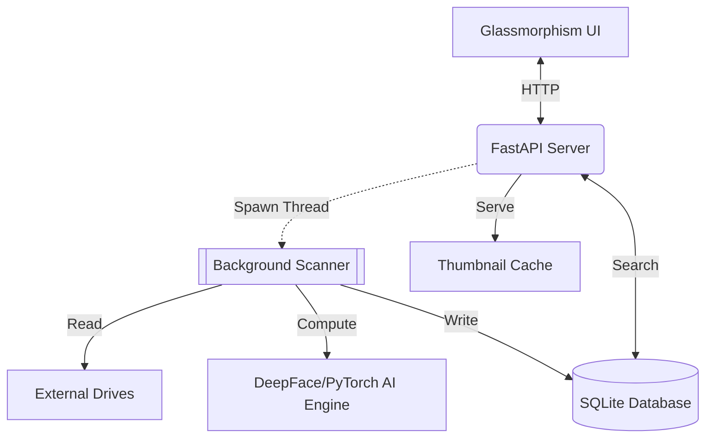
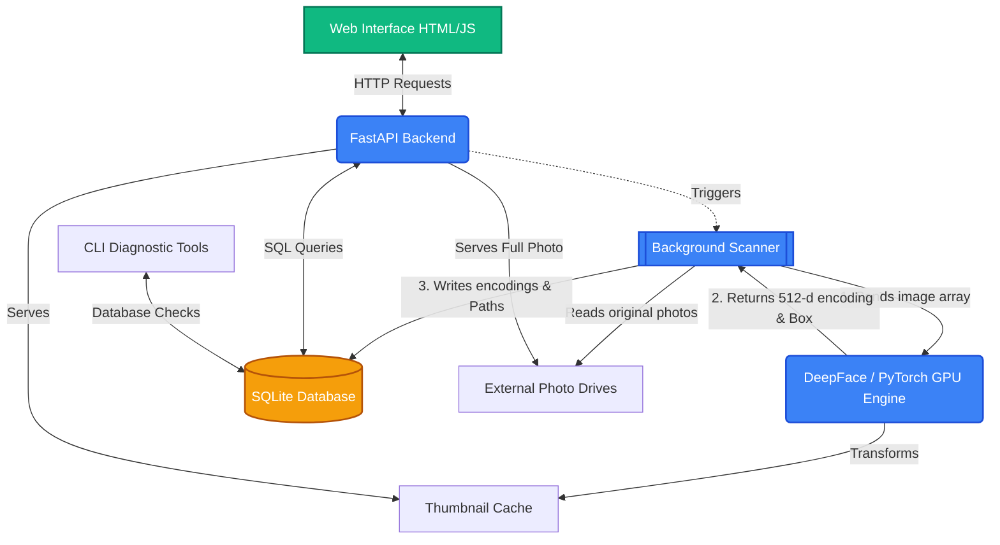

# Photo AI Manager (V1.5)

This is a totally local, private, AI-powered system designed to index large physical drives of photos, recognize faces with high-fidelity, and allow scalable search.

---

## 🏗️ Architecture & Decision Rationale

The Photo AI Manager is designed for **total privacy** and **high-performance local compute**. Every architectural choice prioritizes these two goals over cloud scalability.

### Architecture Overview
The system follows a **Monolithic API + Threaded Worker** pattern.

### Why These Decisions?
-   **FastAPI**: Chosen for its native asynchronous support, which allows the UI to poll the scanner's progress without blocking the main event loop.
-   **SQLite (`index.db`)**: Provides a zero-config, portable database that lives alongside your photos. It lacks the overhead of Postgres but handles 10,000+ photos with sub-millisecond query times.
-   **Facenet512 (AI Engine)**: We chose `Facenet512` over standard `dlib` or `MTCNN` because it provides 4x more biometric detail per face, significantly reducing "masking" errors (people mistaken for others).
-   **Agglomerative Clustering**: We moved from DBSCAN to `AgglomerativeClustering` with 'complete linkage' because it prevents "chaining" (where one bad angle incorrectly merges two different people into the same cluster).
-   **Vanilla JS/CSS**: By avoiding React or Tailwind, we keep the frontend lightweight and ensure the project remains functional for years without dependency rot.

---

## 🚀 Key Features

*   **512-d Recognition**: Upgraded from 128-d to **Facenet512**, providing 4x higher detail per face for commercial-grade accuracy.
*   **Auto-Recognition**: AI "remembers" people you have already named and automatically tags them in new scans.
*   **Search Pagination**: Highly scalable search interface that can handle thousands of results with snappy Next/Prev controls.
*   **Detection Reliability**: Automatic in-memory image downsampling (to 1280px) ensures face detection never fails on high-resolution (10MB+) photos.
*   **Windows Optimized**: Integrated `PYTHONUTF8` environment handling to prevent console crashes during AI processing.

---

## 🚀 Key Features

*   **512-d Recognition**: Upgraded from 128-d to **Facenet512**, providing 4x higher detail per face for commercial-grade accuracy.
*   **Auto-Recognition**: AI "remembers" people you have already named and automatically tags them in new scans.
*   **AI Scene Intelligence**: Integrated **MobileNetV3** for 1,000-category object recognition (German Shepherd, Lion, Sunset, etc.) with a 0.5 confidence floor.
*   **Multi-Term Search**: Supports powerful keyword combinations like "Kenya Lion" using refined AND-logic.
*   **Search Pagination**: Highly scalable search interface that can handle thousands of results with snappy Next/Prev controls.
*   **Detection Reliability**: Automatic in-memory image downsampling (to 1280px) ensures face detection never fails on high-resolution (10MB+) photos.

---

## 📂 Script Breakdown

### 1. `main_backend.py` (The API Server)
Runs the `FastAPI` server. It handles face clustering, identity matching, and paginated searches through both social and object keywords.

### 2. `scanner.py` (The Heavy Lifter)
Our master processing script. It handles:
- **EXIF Discovery**: Extracts GPS and Date Taken.
- **Face Fingerprinting**: Generates 512-d biometric vectors.
- **Scene Awareness**: Runs the 1,000-class object classifier to tag 'Lions', 'Dogs', and 'Places'.
- **Thumbnail Processing**: Creates 150x150p face crops and full thumbnails.

### 3. `scene_utils.py` (The Scene Intelligence Layer)
The new brain for object awareness.
* **Extraction**: Predicts what is in the photo (e.g., "African Elephant: 0.98").
* **Keywords**: Commits high-confidence tags to your photo library for instant search.

### 4. `tools/` (CLI Diagnostics)
Maintenance scripts for the AI library:
* `tools/retag_existing.py`: High-performance tool to analyze all 4,000 of your existing photos to add 'Scene' awareness.
* `tools/analyze_distances.py`: Distance gap analysis for the 512-d biometric space.
* `tools/debug_face_512.py`: Diagnostics for identity recognition.

### 5. `templates/` & `static/`
Modern UI built with **Glassmorphism** design principles, using raw JS and CSS for maximum customizability.

---

## ⚙️ Running the Project

1. **Requirements**: `pip install -r requirements.txt`
2. **Execution**: Always use **`run.bat`** on Windows. This ensures `PYTHONUTF8=1` is set, preventing console crashes caused by emojis in AI libraries.
