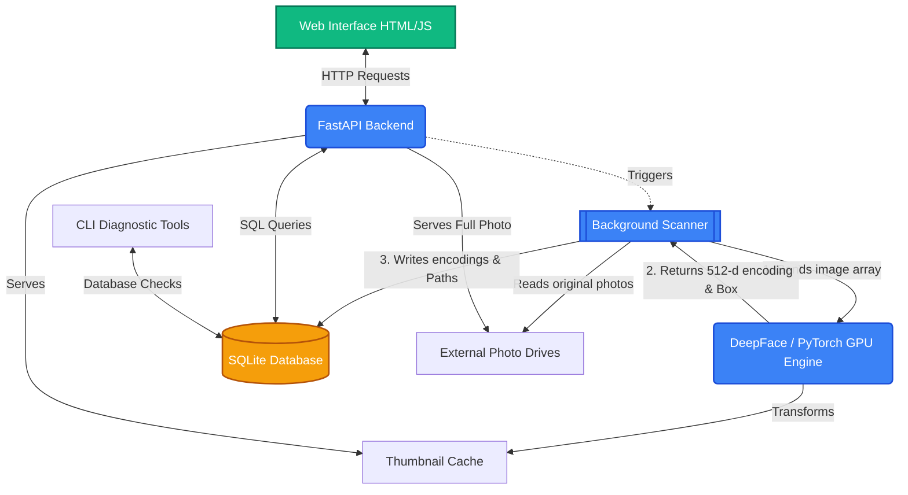

# Photo AI Manager (V1.5)

This is a totally local, private, AI-powered system designed to index large physical drives of photos, recognize faces with high-fidelity, and allow scalable search.

---

## 🏗️ Architecture & Data Flow

Here is a high-level visual representation of how the components talk to one another:

---

## 🚀 Key Features

*   **512-d Recognition**: Upgraded from 128-d to **Facenet512**, providing 4x higher detail per face for commercial-grade accuracy.
*   **Auto-Recognition**: AI "remembers" people you have already named and automatically tags them in new scans.
*   **Search Pagination**: Highly scalable search interface that can handle thousands of results with snappy Next/Prev controls.
*   **Detection Reliability**: Automatic in-memory image downsampling (to 1280px) ensures face detection never fails on high-resolution (10MB+) photos.
*   **Windows Optimized**: Integrated `PYTHONUTF8` environment handling to prevent console crashes during AI processing.

---

## 📂 Script Breakdown

### 1. `main_backend.py` (The API Server)
Runs the `FastAPI` server. It handles face clustering, identity matching, and paginated searches.

### 2. `scanner.py` (The Heavy Lifter)
Recursively indexes folders, reads EXIF metadata (Date/GPS), and extracts faces.
* **Auto-Downsampling**: Dynamically resizes huge images in-memory to keep the AI engine fast and reliable.

### 3. `face_utils.py` (The AI Engine)
Re-engineered to use **PyTorch and DeepFace (RetinaFace)**.
* **Extraction**: Generates 512-float mathematical arrays for setiap face.
* **Recognition**: Contains the centroid-based matching logic for auto-tagging.

### 4. `tools/` (CLI Diagnostics)
A dedicated folder for library maintenance:
* `tools/check_db.py`: Verifies database integrity.
* `tools/analyze_distances.py`: Analyzes how 'close' different identities are in the AI's 512-d space.
* `tools/debug_face_512.py`: Diagnostic tool for the recognition engine.
* `tools/reset_faces.py`: High-fidelity data migration tool.

### 5. `templates/` & `static/`
Modern UI built with **Glassmorphism** design principles, using raw JS and CSS for maximum customizability.

---

## ⚙️ Running the Project

1. **Requirements**: `pip install -r requirements.txt`
2. **Execution**: Always use **`run.bat`** on Windows. This ensures `PYTHONUTF8=1` is set, preventing console crashes caused by emojis in AI libraries.
