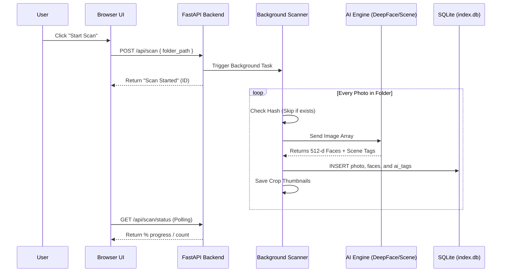

# Photo AI Manager — System Flows & API Specs

This document provides a detailed technical map of the Photo AI Manager's internal logic, identifying how data moves between the UI, API, and background workers.

---

## 🏎️ Core System Flows

### 1. The Scanning Journey
How a photo moves from the disk to the database with AI metadata.

---

## 📡 API Specifications

| Endpoint | Method | Purpose | Response |
|---|---|---|---|
| `/api/scan` | POST | Starts a library scan | `{ "status": "started" }` |
| `/api/scan/status` | GET | Check progress of active scan | `{ "total": 1500, "scanned": 450 }` |
| `/api/faces` | GET | Retrieve unknown face clusters | `{ "clusters": [...] }` |
| `/api/faces/bulk_tag` | POST | Tags a group of faces with a name | `{ "updated": 45 }` |
| `/api/search` | GET | Paginated multi-term search | `{ "results": [...], "total": 128 }` |
| `/api/health` | GET | Reliability Shield check | `{ "status": "ok", "version": "1.6.0" }` |

---

## 🗄️ Database Schema (SQLite)

### Table: `photos`
| Column | Type | Description |
|---|---|---|
| `id` | INTEGER | Primary Key |
| `path` | TEXT | Physical file location |
| `hash` | TEXT | Unique MD5 hash for skip-detection |
| `date_taken` | TIMESTAMP | EXIF Date |
| `location` | TEXT | GPS/Folder name |
| `ai_tags` | TEXT | JSON list of scene objects |

### Table: `faces`
| Column | Type | Description |
|---|---|---|
| `id` | INTEGER | Primary Key |
| `photo_id` | INTEGER | Foreign Key → photos.id |
| `person_id` | INTEGER | Foreign Key → people.id (NULL if unknown) |
| `encoding` | BLOB | 512-d Facenet fingerprint |
| `box` | TEXT | Bounding box [x, y, w, h] |

---

## ⚙️ Script Sequences

1.  **`run.bat`**: Sets `PYTHONUTF8=1` and launches `uvicorn main_backend:app`.
2.  **`main_backend.py`**: Initializes the FastAPI app and mounts static paths. Calls `check_models_health()` on startup.
3.  **`scanner.py`**: Executed as a thread by the backend. Imports `face_utils` and `scene_utils`.
4.  **`shield.py`**: A standalone test suite that runs HTTP requests against the running API to ensure 100% stability.
